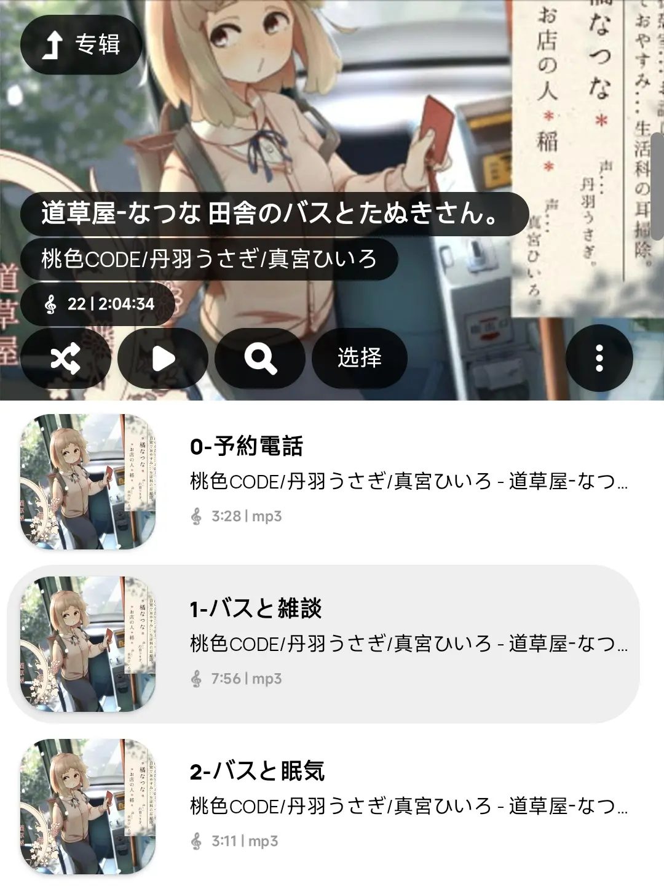

# DLmeta GUI

为你的 DLsite 音声资源转换格式，添加元信息，以在播放器显示封面、筛选社团 / CV。

关联项目：[Zhousiru/dlmeta](https://github.com/Zhousiru/dlmeta)

## 效果

**FROM**

```
RJ325494-道草屋-なつな-田舎のバスとたぬきさん。
│  0-予約電話.mp3
│  ...
├─mp3
│  ├─1-都会のたぬきさん。mp3
│  │      1-バスと雑談.mp3
│  │      ...
│  │  
│  ├─2-お試しマッサージ。mp3
│  │      1-なつなです。.mp3
│  │      ...
│  │  
│  └─3-生活科の耳掃除。mp3
│          01-今夜借りたもの。.mp3
│          ...
├─WAV
│  ├─1-都会のたぬきさん。
│  │      1-バスと雑談.wav
│  │      ...
│  │  
│  ├─2-お試しマッサージ。
│  │      1-なつなです。.wav
│  │      ...
│  │  
│  └─3-生活科の耳掃除。
│          01-今夜借りたもの。.wav
│          ...
└─数コマ
        1-1.jpg
        ...
```

**TO**



## 使用

1. 下载 `ffmpeg`，并将其添加到环境变量
   （[Windows Builds](https://github.com/BtbN/FFmpeg-Builds/releases)）
2. 下载 [Zhousiru/dlmeta](https://github.com/Zhousiru/dlmeta) （需要安装 Python）
3. 从 [release](https://github.com/Zhousiru/dlmeta-gui/releases) 下载 DLmeta GUI，或自行打包
4. 打开 DLmeta GUI，进行设置
5. 完成 \_(:з」∠)\_

## 注意

* DLmeta CLI 默认 HTTP Proxy 为 `http://127.0.0.1:7890`，可在 `internal/util.py` 修改 `PROXY` 值
* 当前 GUI 只支持以 `-` 分割的文件夹名，即 `RJ123456-XXXXX`
* 当前 GUI 只支持 `wav` 到 `mp3` 格式的转换

## TODO List

**长期**计划（真的很长）

* 支持对 CLI 配置项的设定
* 支持自定义文件名匹配正则表达式
* 支持 `wav` 到 `flac` 格式的转换

## Build Script

```
yarn eb:dist
```
